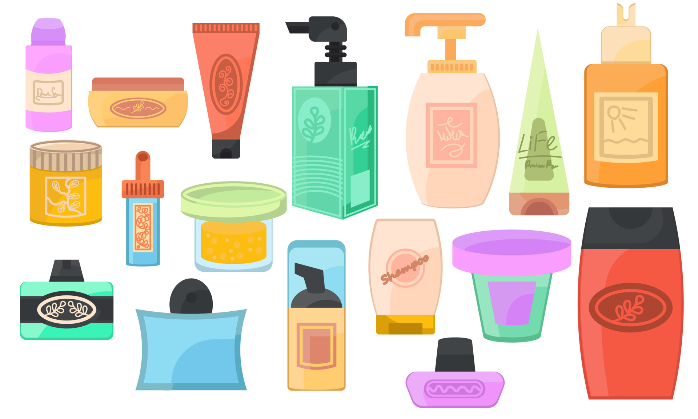
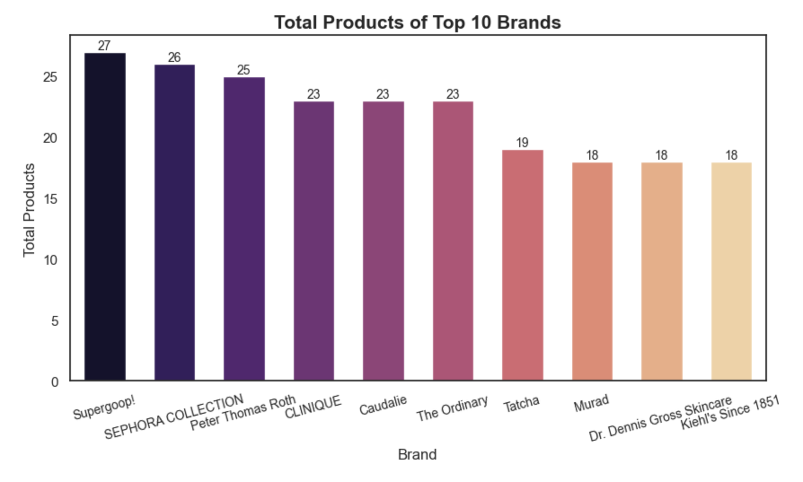
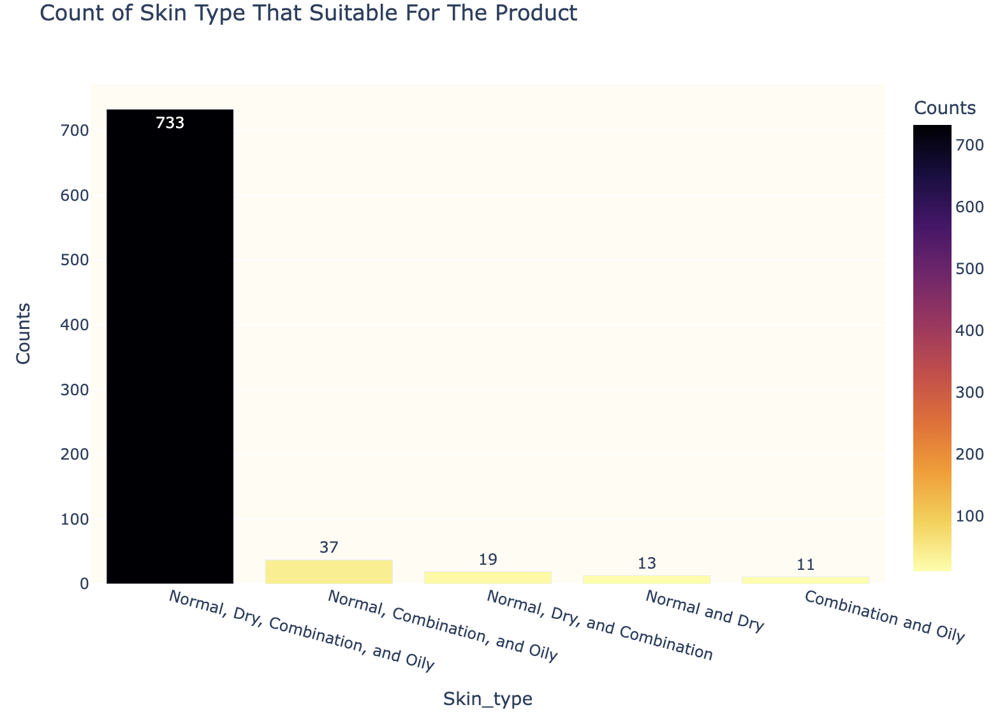
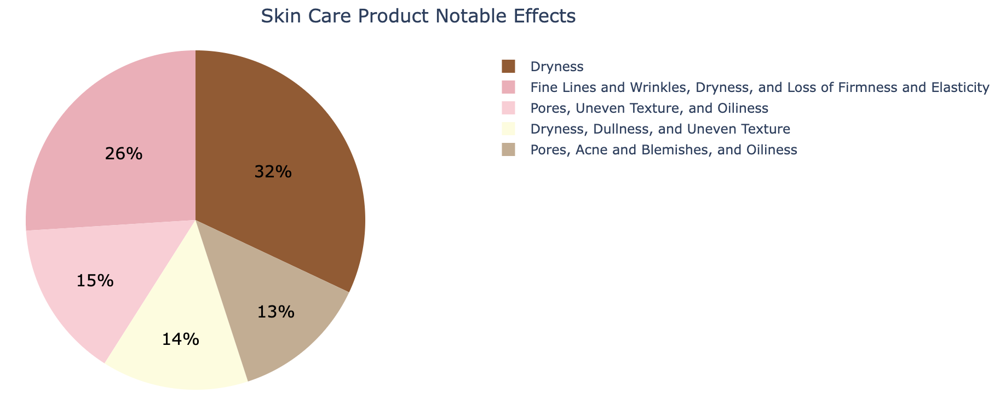
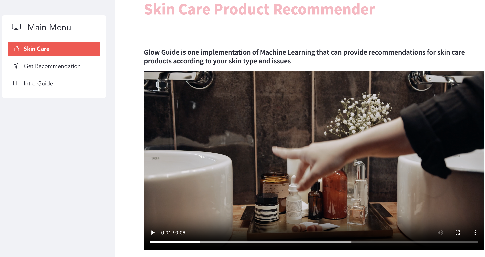
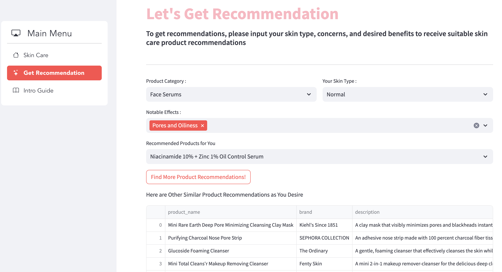
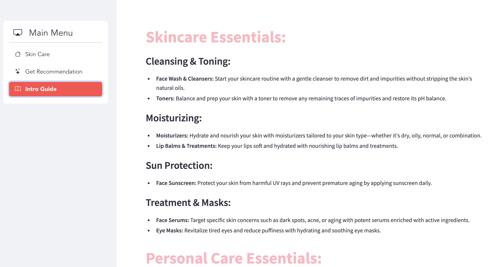

# Skincare Recommender System Based on Skin Problem Using Content-Based Filtering  

 

 
Nowadays, skin care is becoming one of the most essential things in our lives. Skincare products have grown rapidly everywhere and tend to increase year by year. So do not be surprised if there are so many skin care products circulating in the community. However, the large number of product choices makes it difficult for people to choose the product that best suits their facial needs. Therefore, I took the initiative to create a system that is able to recommend skin care products based on facial skin problems. In this study, I use the method of content-based filtering in making the recommendation system. This recommendation system is made without using rating data, so the algorithm approach used is cosine similarity and TF-IDF in finding similarity features. Then, the first output that appears will be used by the machine as historical data to then enter the content-based filtering stage. So, users will get recommendations according to the selected keywords and similar products.   
 

 
This project uses datasets scraped independently from Sephora websites with details:  
  

| Feature Name | Description | 
| --- | --- | 
|**product_href** | Product URL link |
|**product_name** | Product name |
|**product_type** |Type of product |
|**brand** | Product brand |
|**notable_effects** | What it's good for |
|**skin_type** | The suitable type of skin for the product (Normal, Dry, Oily, Combination) |
|**price** | Product price (in USD) |
|**description** | Product description |

# Data Overview  

1. In total, there are 938 products scrapped from websites.  
2. Because this data was scrapped and arranged by me, it looks neater and cleaner. There's no null value.  
3. Fortunately, there are 0 duplicate rows. No needs to be removed.  
4. Of many different types of products, Face Serums is more hype than others.   
5. Supergoop! is the top brand, which means they have many kinds of products.  
6. From many pairs of notable effects, 150 products are good Dryness.
7. Looks like many skin care products suitable for all skin types including Normal, Dry, Combination, Oily.  

# Exploratory Data Analysis (EDA)  
**1. Top Brands With Their Products**  
  From 101 beauty brands, here are the top 10 brands with the most products. Supergoop! is the top brand, which means they have many kinds of products.
 

**2. Skin Care Product Type**  
  There are many different types of products, but Face Serums is more hype than others.

**3. Product Skin Type**  
Each skincare product is formulated to be suitable for certain skin types so that the benefits obtained are more precise. Skin types are normal, dry, oily, combination. There are products that are suitable for all skin types, some are suitable only for dry skin, only for oily skin. The following are the skin types that are most often found in skincare products.  
 

 

**4. Skin Care Product Notable Effects**  
Just like the type of skin that is suitable for a skin care product, the perceived benefits are also directed at the facial skin problem that we want to overcome. There are products specifically for treating dryness, fine lines and wrinkles and loss of firmness and elasticity. The following are the top 5 notable effects that can be obtained in one product.  
 

 

# App  
This project has been deployed using Streamlit. Please visit the link here https://skin-care-recommender-system-141.streamlit.app/.  
App in overall  
 

 
----

 
-----

 

Thank You!
